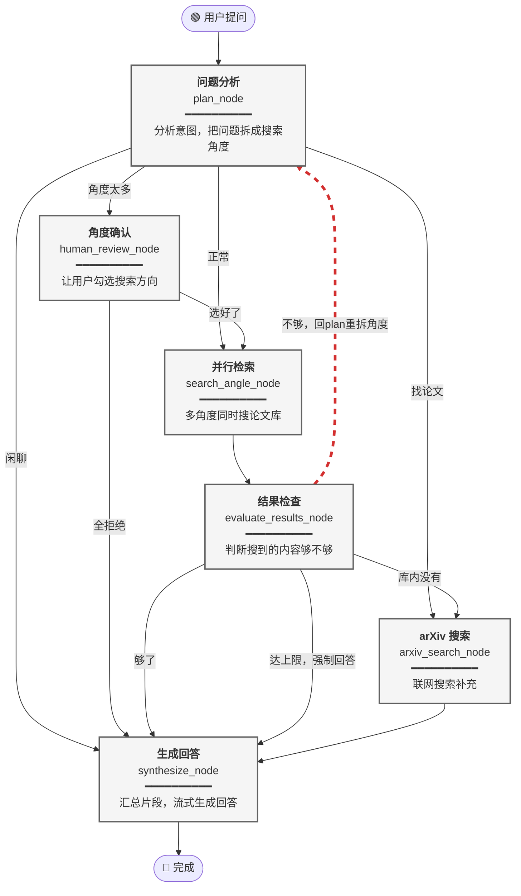
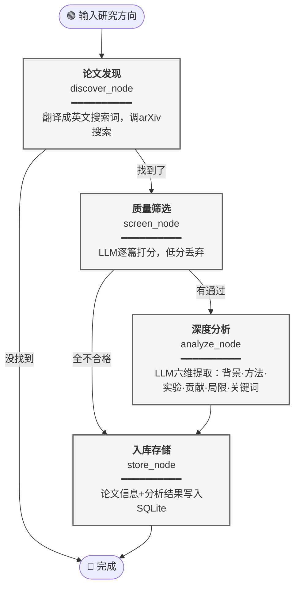

# Paper-Copilot — 两张 LangGraph 图

---

## 图一：Research Graph（研究问答图）

### 一句话概括

用户向知识库提问，系统进入一个**搜索-评估循环**：拆角度 → 并行搜论文 → 检查够不够 → 不够就带着已有结果重新拆角度再搜，够了就出来生成带引用的回答。

### 图

### 文字总结

**6 个节点**：

| 节点 | 代码函数 | 做什么 |
|---|---|---|
| 问题分析 | `plan_node` | 规则判断意图（闲聊→跳过搜索；找论文→直通arXiv）；复杂问题调LLM拆成多个搜索角度。第2轮起会带上已搜结果，让LLM生成**新**角度 |
| 角度确认 | `human_review_node` | 角度太多时暂停，展示给用户勾选，减少无效搜索 |
| 并行检索 | `search_angle_node` | 每个角度一个实例，同时去FAISS搜论文片段，结果自动合并去重 |
| 结果检查 | `evaluate_results_node` | LLM判断搜到的内容是否足以回答，决定继续循环还是跳出 |
| arXiv搜索 | `arxiv_search_node` | 本地库没有时，去arXiv在线搜，只执行一次 |
| 生成回答 | `synthesize_node` | 汇总所有片段去重截断，LLM流式生成回答并标注来源 |

**核心循环**：`plan_node → search_angle_node → evaluate_results_node → plan_node`

evaluate判定不够时回到plan_node，plan_node会把已搜过的角度和已找到的内容告诉LLM，让LLM补充**新的**搜索方向。最多循环3轮，达到上限后强制进入synthesize。

**三条不进入循环的路径**：
- 闲聊 → plan → synthesize
- 找论文 → plan → arxiv → synthesize
- 角度太多 → plan → human_review → search → evaluate → ...

---

## 图二：Paper Workflow Graph（论文入库流水线图）

### 一句话概括

一条直线流水线，无循环：用户给研究方向，系统自动去arXiv找论文 → 筛掉低质量的 → 深度分析通过的 → 入库。

### 图

### 文字总结

**4 个节点**，纯线性，无条件循环：

| 节点 | 代码函数 | 做什么 |
|---|---|---|
| 论文发现 | `discover_node` | LLM把中文主题转成英文搜索词，调arXiv API搜索，结果少就换词重搜 |
| 质量筛选 | `screen_node` | LLM逐篇评估质量和相关度（0-10分），低于阈值的丢弃 |
| 深度分析 | `analyze_node` | LLM逐篇提取六个维度的结构化信息 |
| 入库存储 | `store_node` | 元数据+分析结果写入SQLite，后续上传PDF向量化后可被图一检索 |
